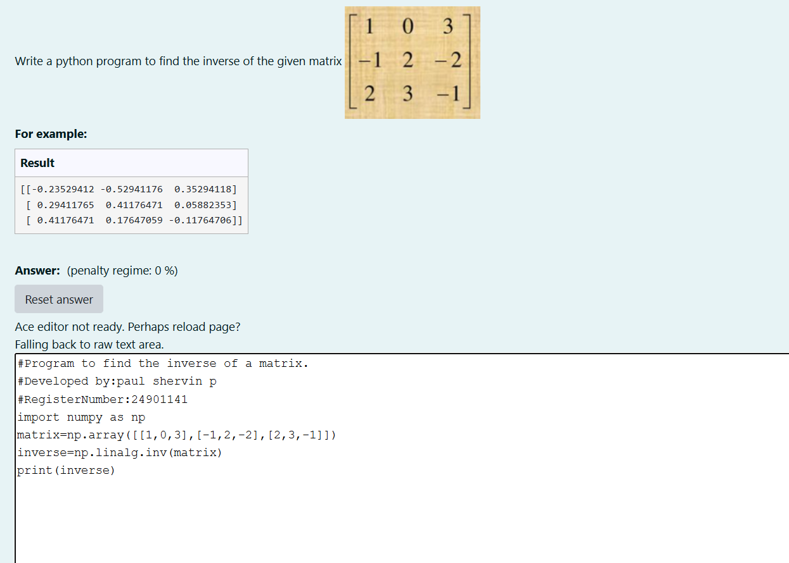

# INVERSE-OF-A-MATRIX
## Aim:
To write a python program to find the inverse of a matrix
## Equipment’s required:
1. 	Hardware – PCs
2. 	Anaconda – Python 3.7 Installation / Moodle-Code Runner
## Algorithm:
###Step1 : import numpy as np
###Step 2: give input in the array format
###Step 3: inverse=np.linalg.inv(matrix)
###Step 4: print the inverse of the given matrix
## Program:
```
#Program to find the inverse of a matrix.
#Developed by:paul shervin p
#RegisterNumber:24901141
import numpy as np
matrix=np.array([[1,0,3],[-1,2,-2],[2,3,-1]])
inverse=np.linalg.inv(matrix)
print(inverse)
```
## Output:

## Result:
Thus the inverse of given matrix is successfully solved using python program

